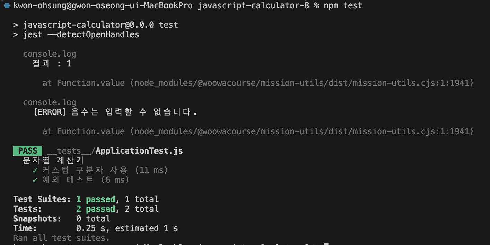

# javascript-calculator-precourse

입력 문자열에서 숫자를 추출해 합하는 콘솔 기반 프로젝트 입니다.
 과제 요구사항을 참고하여 기능 목록 단위 커밋을 위해 기능 체크리스트를 우선적으로 작성합니다.

 

## 요구사항 요약

- 입력
  - 쉼표(,) 또는 콜론(:)은 기본 구분자.
  - 커스텀 구분자: //<문자>\n
  - ex) //;\n1;2;3 → 6 (커스텀 구분자 -> ; )
- 출력
  - 결과: X 형식으로 출력
  - 에러: 잘못된 입력/음수 등은 [ERROR]로 시작하는 메시지와 함께 Error 발생 후 프로그램 종료
  - process.exit()을 활용한 강제 종료 금지
- 환경
  - Node.js v22.19.0 이상, @woowacourse/mission-utils의 Console.readLineAsync, Console.print 사용
  - 시작점: App.js run()

 

## 기능 체크리스트

    README에 기록된 기능 목록 단위로 커밋하기 위한 체크리스트입니다.

- [x] 입력: 콘솔에서 문자열 입력
- [x] 출력: 결과: X 형식 출력
- [x] 에러 처리: 음수/잘못된 입력 시 [Error] 메시지와 함께 예외 발생 후 종료
- [x] 문자열 파싱: 기본/커스텀 구분자 인식
- [x] 계산 로직: 파싱된 문자열 기반으로 계산
- [x] 상수 처리: 메시지/에러 접두사 등 상수 분리

 

## 구현 내용

    전반적인 프로젝트 구조와 각 클래스의 역할에 대해 간단히 정리한 섹션입니다.

|             프로젝트 폴더 구조 (Project Structure)             |
| :------------------------------------------------------------: |
|                        |
| 프로젝트의 주요 클래스 및 역할을 나타내는 디렉터리 구조입니다. |

#### constants

- 프로그램 전역에서 사용하는 상수, 에러 메시지, 구분자 등을 관리하기 위한 폴더입니다.
- 최대한 메시지, 상수 사이의 중복을 방지하고 유지보수성을 높이기 위해 따로 분리했습니다.

#### domain

- 핵심 로직이 위치한 폴더라 domain 명칭을 적용했습니다.
- 입력 문자열을 파싱(Parser), 검증(Validator), 계산(StringCalculator)하는 각각의 클래스로 구성되어 있습니다.

#### factory

- 객체 생성을 중앙에서 관리하기 위한 폴더입니다.
- 특히 외부 라이브러리를 사용하는 입출력 객체를 IOFactory를 통해 캡슐화하였습니다.

#### view

- 실제 사용자와 상호작용하는 부분으로 입력(InputView)과 출력(OutputView)을 담당하도록 했습니다.

#### App.js

- 전체 프로그램의 실행 순서를 제어하는 메인 진입점입니다.
- 각 도메인 클래스와 뷰를 연결하는 역할을 수행하고 있습니다.

 

## 예외처리

- 요구사항에 명시되어 있는 음수 및 커스텀 구분자 형식에 어긋나는 입력을 했을 때 예외를 throw하도록 구현하였습니다.

  - [ERROR] 음수는 입력할 수 없습니다.
  - [ERROR] 커스텀 구분자 형식이 잘못되었습니다.

- 커스텀 구분자로 명시하지 않고 `,` 와 `:`를 제외한 문자 입력 시 예외를 throw하도록 구현했습니다.

  - [ERROR] 유효하지 않은 숫자입니다.

- 커스텀 구분자에 문자를 입력한다고 명시되어있으나, 문자의 기준이 모호하다고 판단해 '//'와 '\n' 이 인식된다면 그 사이 입력된 값을 하나의 문자로 판단할 수 있도록 구현했습니다.

- 커스텀 구분자를 지정하더라도 기본 구분자인 `,` 와 `:`는 항상 인식되도록 구현했습니다.

## 실제 실행 및 테스트 화면

|                실행 화면 캡쳐                |
| :------------------------------------------: |
|                    |
| 커스텀 구분자를 입력했을 때 실행 화면입니다. |

|             테스트 화면 캡쳐              |
| :---------------------------------------: |
|              |
| 정해진 테스트 케이스를 통과한 화면입니다. |

 

## 학습 및 개선 포인트

정해진 구조가 있는 프레임워크, 라이브러리가 아닌 바닐라JS만을 사용한 콘솔 프로젝트를 처음 경험해보았습니다.
 
기본적인 아키텍처 설계 및 JS에서 많이 사용하는 디자인 패턴에 대해 우선적으로 학습했고, 객체 단위로 역할을 명확히 나누는 것에 초점을 맞추어 개발을 진행했습니다.
 
 
아직 테스트 코드 작성에는 익숙치 않아, 기능 개발 후 테스트를 수행해보지는 못했습니다.
 
다음 프로젝트부터는 기능 단위로 Given-When-Then 구조에 맞추어 테스트 코드를 작성해 보다 신뢰성을 높이고 싶습니다.
